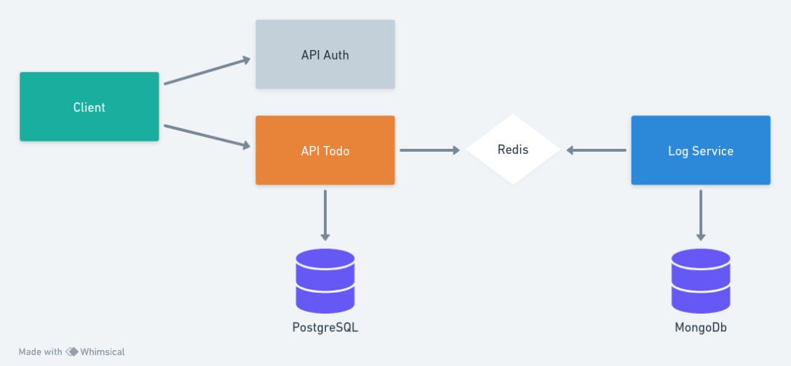

# TECNOUPDATE FOR DEV

## Microserviços na prática
Arquitetura de microsserviços com um exemplo prático desenvolvido em nodejs na versão 18

## Arquitetura de exemplo



## Configuração

### Banco de dados
 Primeiro temos que executar o docker compose para criar os bancos de dados e o redis

``` bash
docker-compose up -d
``` 

### API Auth

API responsável por verificar os dados de login do usuário e retornar o access_token

- `PORT` - porta que a aplicação sera executada
- `JWT_SECRET` - secret para assinar o token

Para executar o projeto

``` bash
  # instalar as dependencias
  npm install

  # executar o projeto
  npm run start
```

#### Rotas
`POST /auth/token` - Rota para autenticação


``` json
{
    "username": "admin",
    "password": "admin"
}
```

### API Todo

API responsável por criar, alterar, consultar e deletar os Todo`s

- `PORT` - porta que a aplicação sera executada
- `JWT_SECRET` - secret para assinar o token, deve ser o mesmo utilizado na API Auth
- `DATABASE_URL` - string de conexão com o banco de dados PostgresSQL

Para executar o projeto

``` bash
  # instalar as dependencias
  npm install

  # criar o banco de dados e gerar os modelos do prisma
  npx prisma migrate dev

  # executar o projeto
  npm run start
``` 

#### Rotas
- `POST /api/v1/todo` - Criar todo


  ``` json
  {
      "content": "Make coffee"
  }
  ``` 

- `PATCH /api/v1/todo/:id` - Alterar todo


  ``` json
  {
      "content": "Drink water"
  } 
  ``` 

- `GET /api/v1/todo` - Listar todos

- `GET /api/v1/todo/:id` - Listar todo específico 
- `DELETE /api/v1/todo/:id` - Deletar todo


### LOG Service

Serviço resonsável por receber e armazenar os logs

- `DATABASE_URL` - string de conexão com o banco de dados mongodb

Para executar o projeto

``` bash
  # instalar as dependencias
  npm install

  # gerar os modelos do prisma
  npx prisma generate

  # criar o banco de dados
  npx prisma db push

  # executar o projeto
  npm run start
``` 
## Author
Octávio Barbosa <br>
[](mailto:octaviobar91@gmail.com)
[](https://www.linkedin.com/in/octaviobarbosa)
[](https://github.com/octaviobarbosa)
